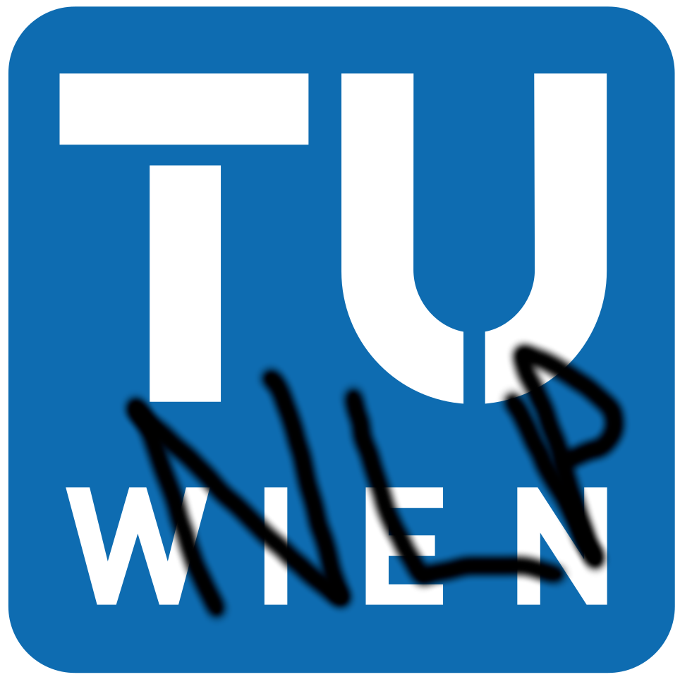

<p align="center">
    <h1>Natural Language Processing and Information Extraction 2022WS - Project</h1>
  
</p>

# About this template

- We created this template repository to help you structure your code during your project.
- During the project you will work in a team (mainly consisting of 4 members) on a given __text classification__ project.
- Each team will have an assigned supervisor who will guide you through the project and helps you with any questions you might have.
- Each supervisor will have topics you can choose from.
- This template repository contains a __sample__ solution for a classification task. We will use the _IMDB movie review dataset_ as an example. This will also be covered in the _Text Classification_ lecture.
- We will only use a sample of the data to make the training process faster. You can use the full dataset if you want to.
- The sample solution is just for you to get an idea of how to structure your code. You can use it as a starting point for your own solution (it cannot be the same as the sample solution).
- The repository only contains solutions for __Milestone 1__ and __Milestone 2__. __Milestone 3__ will be specific for each team and each topic.
- You are also allowed to change the structure of this repository if you want to, __but it is important to specify the requirements, the steps needed to run your code and the directory structure in the README file__.
- __The code was tested on Ubuntu, it should also work on Windows and Mac OS, but you might need to make some changes.__
- __Please fill the team.cfg file with your team members and their STUDENT IDs.__

This project should cover the following topics:
- How to structure your project in a GitHub repository
- How can you use the GitHub repository to collaborate with your team members
- How to use the GitHub repository to version control your code
- Find your own dataset, preprocess and understand it
- __Milestone 1__: Train a simple (sklearn baseline) model on your dataset
- __Milestone 2__: Train a more complex model on your dataset (some neural network model based on PyTorch)
- In both milestones it is important to evaluate your model and also look at the errors manually and try to understand why the model makes mistakes
- Your reports can be written in any format (e.g. in Jupyter Notebooks or in simple Markdown) and should be stored in the `docs` folder
- __Milestone 3__: This is the final milestone, it will be unique for each team, you should contact your supervisor to discuss what you should do in this milestone

# Install and Quick Start

First create a new conda environment with python 3.10 and activate it:

```bash
conda create -n tuwnlpie python=3.10
conda activate tuwnlpie
```

Then install this repository as a package, the `-e` flag installs the package in editable mode, so you can make changes to the code and they will be reflected in the package.

```bash
pip install -e .
```

All the requirements should be specified in the `setup.py` file with the needed versions. If you are not able to specify everything there
you can describe the additional steps here, e.g.:

Install `black` library for code formatting:
```bash
pip install black
```

Install `pytest` library for testing:
```bash
pip install pytest
```

## The directory structure and the architecture of the project

```
📦project-2022WS
 ┣ 📂data
 ┃ ┣ 📜README.md
 ┃ ┣ 📜bayes_model.tsv
 ┃ ┣ 📜bow_model.pt
 ┃ ┗ 📜imdb_dataset_sample.csv
 ┣ 📂docs
 ┃ ┗ 📜milestone1.ipynb
 ┣ 📂images
 ┃ ┗ 📜tuw_nlp.png
 ┣ 📂scripts
 ┃ ┣ 📜evaluate.py
 ┃ ┣ 📜predict.py
 ┃ ┗ 📜train.py
 ┣ 📂tests
 ┃ ┣ 📜test_milestone1.py
 ┃ ┣ 📜test_milestone2.py
 ┣ 📂tuwnlpie
 ┃ ┣ 📂milestone1
 ┃ ┃ ┣ 📜model.py
 ┃ ┃ ┗ 📜utils.py
 ┃ ┣ 📂milestone2
 ┃ ┃ ┣ 📜model.py
 ┃ ┃ ┗ 📜utils.py
 ┃ ┗ 📜__init__.py
 ┣ 📜.gitignore
 ┣ 📜LICENSE
 ┣ 📜README.md
 ┣ 📜setup.py
```

- `data`: This folder contains the data that you will use for training and testing your models. You can also store your trained models in this folder. The best practice is to store the data elsewhere (e.g. on a cloud storage) and provivde download links. If your data is small enough you can also store it in the repository.
- `docs`: This folder contains the reports of your project. You will be asked to write your reports here in Jupyter Notebooks or in simple Markdown files.
- `images`: This folder contains the images that you will use in your reports.
- `scripts`: This folder contains the scripts that you will use to train, evaluate and test your models. You can also use these scripts to evaluate your models.
- `tests`: This folder contains the unit tests for your code. You can use these tests to check if your code is working correctly.
- `tuwnlpie`: This folder contains the code of your project. This is a python package that is installed in the conda environment that you created. You can use this package to import your code in your scripts and in your notebooks. The `setup.py` file contains all the information about the installation of this repositorz. The structure of this folder is the following:
  - `milestone1`: This folder contains the code for the first milestone. You can use this folder to store your code for the first milestone.
  - `milestone2`: This folder contains the code for the second milestone. You can use this folder to store your code for the second milestone.
  - `__init__.py`: This file is used to initialize the `tuwnlpie` package. You can use this file to import your code in your scripts and in your notebooks.
- `setup.py`: This file contains all the information about the installation of this repository. You can use this file to install this repository as a package in your conda environment.
- `LICENSE`: This file contains the license of this repository.
- `team.cfg`: This file contains the information about your team.


# Running the code
First download all the resources that you need for the project. You can find all the information in the `data/README.md` file. We also provide pretrained models for evaluation.

In the `scripts` folder you can find the scripts that you can use to train, evaluate and test your models. 

We have two scripts implemented for you:
- `train.py`: This script is used to train your models. It should expect a dataset file as an input and it should save the trained model in a file.

```bash
train.py [-h] -t TRAIN_DATA [-s] [-sp SAVE_PATH] [-m {1,2}]

optional arguments:
  -h, --help            show this help message and exit
  -t TRAIN_DATA, --train-data TRAIN_DATA
                        Path to training data
  -s, --save            Save model
  -sp SAVE_PATH, --save-path SAVE_PATH
                        Path to save model
  -m {1,2}, --milestone {1,2}
                        Milestone to train
```

- `evaluate.py`: This script is used to evaluate your models. It should expect a dataset file as an input and it should load the trained model from a file. The script should predict the labels for the dataset and it should print the accuracy metrics of the model.

```bash
evaluate.py [-h] -t TEST_DATA -sm SAVED_MODEL [-sp] [-m {1,2}]

optional arguments:
  -h, --help            show this help message and exit
  -t TEST_DATA, --test-data TEST_DATA
                        Path to test data
  -sm SAVED_MODEL, --saved-model SAVED_MODEL
                        Path to saved model
  -sp, --split          Split data
  -m {1,2}, --milestone {1,2}
                        Milestone to evaluate
```                        


## Run Milestone 1

__Training__:

To train a model on the IMDB dataset and then save the weights to a file, you can run a command:

```bash
python scripts/train.py -t data/imdb_dataset_sample.csv -s -sp data/bayes_model.tsv -m 1
```

__Evaluation__:

To evaluate the model on the dataset with a trained model, you can run a command (you can also provide a pretrained model, so if someone wants to evaluate your model, they can do it without training it):

```bash
python scripts/evaluate.py -t data/imdb_dataset_sample.csv -sm data/bayes_model.tsv -sp -m 1
```

## Run Milestone 2

__Training__:

To train the neural network on the IMDB dataset and then save the weights to a file, you can run a command:

```bash
 python scripts/train.py -t data/imdb_dataset_sample.csv -s -sp data/bow_model.pt -m 2
```

__Evaluation__:
    
To evaluate the model on the dataset with the trained weights, you can run a command (you can also provide a pretrained model, so if someone wants to evaluate your model, they can do it without training it):

```bash
python scripts/evaluate.py -t data/imdb_dataset_sample.csv -sm data/bow_model.pt -sp -m 2
```

# Running the tests

For testing we use the `pytest` package (you should have it installed with the command provided above). You can run the tests with the following command:

```bash
pytest
```

# Code formatting
To convey a consistent coding style across the project, we advise using a code formatter to format your code.
For code formatting we use the `black` package (you should have it installed with the command provided above). You can format your code with the following command:

```bash
black .
```
